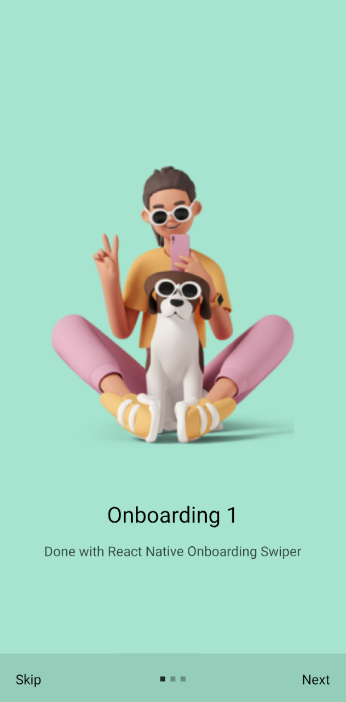
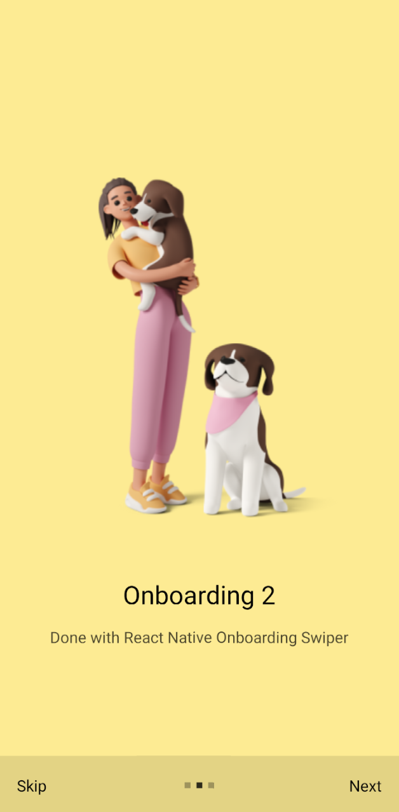
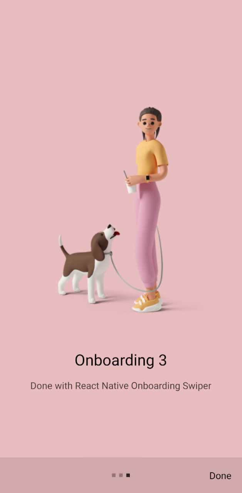

# onboarding-react-native

## About The Project

Is a simple Onboarding Android application using the React-Native language.

|  |  |  |
| --------------------- | --------------------- | ------------------ |

## Getting Started

1. Read the official React-Native documentation

   ```
    https://reactnative.dev/docs/getting-started
   ```

2. Clone git repository

   ```sh
    git clone https://github.com/akhidnukhlis/onboarding-react-native.git
   ```

3. Run command using npx

   ```sh
    npx expo start
   ```

## Contact

Name - @akhidnukhlis - <nukhlis@gmail.com>

Project Link: <https://github.com/akhidnukhlis>

***
